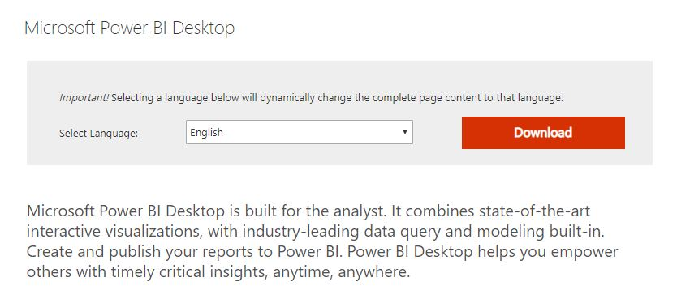
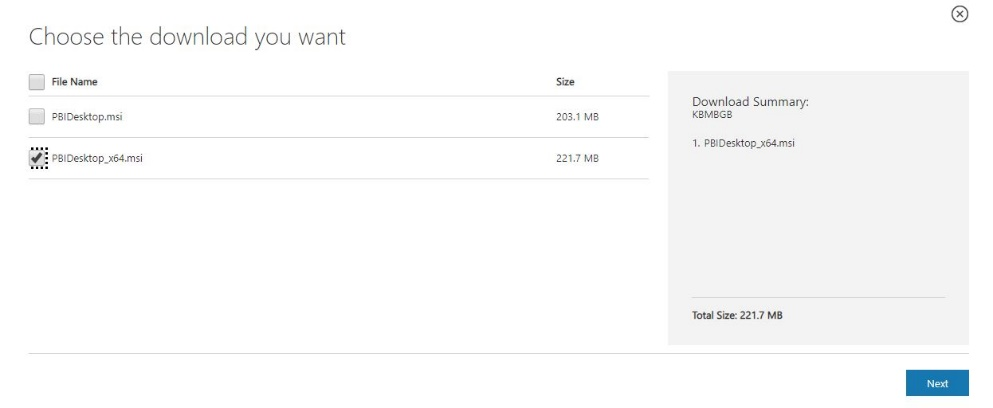
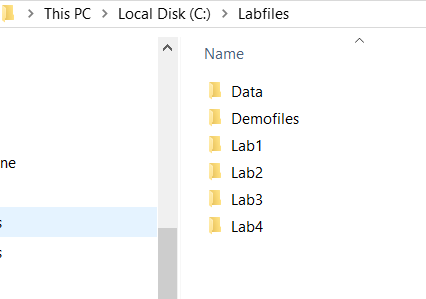

Introduction to Power BI
========================

Exercise 1: Download and Install the Power BI Desktop
-----------------------------------------------------

#### Scenario

>   With Power BI Desktop, you connect to data, shape data, and use the
>   resulting model to create reports. Power BI Desktop centralises, simplifies,
>   and streamlines what can otherwise be a scattered, disconnected, and arduous
>   process of designing and creating business intelligence repositories and
>   reports.

>   The main tasks for this exercise are as follows:

-   Download the Power BI Desktop installer.

-   Install the Power BI Desktop.

>   Estimated Time to complete: 15 min

####  Task 1: Download Power BI Desktop

1.  Open a new browser window and navigate to:
    +++<https://aka.ms/PBISingleInstaller>+++

2.  When the Microsoft Power BI Desktop download page appears, click the
    download button as shown:  
    *(accepting* English *as the default)*

1.  In Choose the download you want dialog, select the checkbox next to
    *PBIDekstop_x64.msi* as shown:

1.  Click **Next** to start the download.

####  Task 2: Install the Power BI Desktop 

1.  Once the download has completed, start the **PowerBIDesktopSetup_64.exe**
    application (installer) by clicking the file name in the status bar of your
    browser. (If the file is not visible in the status bar or you have closed
    the browser, run the file from your default downloads folder)

>   **Note:** *When prompted with the User Account Control dialog, choose Yes.*

1.  Keep clicking **Next** to install the Power BI Desktop accepting the
    defaults in the setup wizard. Take note of the End User License Agreement.

2.  When installation is complete, ensure the option to Launch Microsoft Power
    BI Desktop is cleared then click **Finish**. We don’t want to start the
    Power BI Desktop just yet. Continue with the next exercise to download and
    install the lab exercise files.

End of Exercise

Exercise 2: Download and Install Lab Exercise Files
---------------------------------------------------

In this exercise you will download and install the exercise files and lab
solutions from a shared location on the internet. These files must be installed
to C:\\LabFiles for the solutions to work correctly without modification. There
are many other resources and references for further study at this location, feel
free to access them in your own time.

####  Task 1: Download the Power BI Essentials course files

1.  Open a new browser window and navigate to:
    +++<https://tinyurl.com/yd8r2uha>+++

2.  Click on the labfiles icon to download the **labfiles.zip** archive.

3.  This will save the file to the default **Downloads** folder

4.  Once the download is complete, open File Explorer to the **Downloads**
    folder.

5.  Right click the **labfiles.zip** file and choose **Extract All**.

6.  Enter the folder name of C:\\ to extract the files to.

7.  This will create a new folder called: **C:\\Labfiles** with the following
    folder structure.

>   .

>   **Note:** If you extract the files to a different location some of the lab
>   solution files will no longer work correctly. You will need to change the
>   source path to the new location if you do so.

End of Exercise

>   **Results**: After these exercises, you will have downloaded and installed
>   the Power BI Desktop and the course exercise files.
