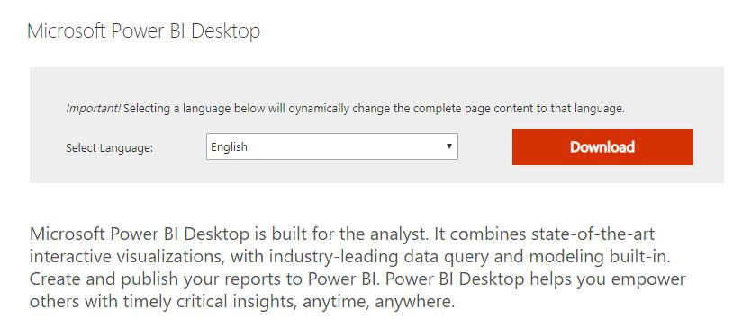

Date:

Version:

Introduction to Power BI
========================

Exercise 1: Download and Install the Power BI Desktop 
------------------------------------------------------

#### Scenario 

>   With Power BI Desktop, you connect to data, shape data, and use the
>   resulting model to create reports. Power BI Desktop centralises, simplifies,
>   and streamlines what can otherwise be a scattered, disconnected, and arduous
>   process of designing and creating business intelligence repositories and
>   reports.

>   The main tasks for this exercise are as follows:

-   Download the Power BI Desktop installer.

-   Install the Power BI Desktop.

>   Estimated Time to complete: 15 min

####  Task 1: Download Power BI Desktop

1.  Open a new browser window and navigate to: <http://powerbi.com>.

1.  Click the **START FREE \>** button.

2.  On the next screen click **ADVANCED DOWNLOAD OPTIONS \>** in the Getting
    started with Power BI Desktop section:

1.  When the Microsoft Power BI Desktop advanced download dialog appears, click
    the download button as shown:

1.  In Choose the download you want dialog, select the checkbox next to
    *PBIDekstop_x64.msi* as shown:

1.  Click **Next** to start the download.

####  Task 2: Install the Power BI Desktop 

1.  Once the download has completed, start the **PBIDesktop_x64.msi** installer
    by clicking the file name in the status bar of your browser. (If the file is
    not visible in the status bar or you have closed the browser, run the msi
    file from your default downloads folder)

>   **Note:** *When prompted with the User Account Control dialog, choose Yes.*  
>   

1.  Keep clicking **Next** to install the Power BI Desktop accepting the
    defaults in the setup wizard. Take note of the End User License Agreement.

2.  When installation is complete, ensure the option to Launch Microsoft Power
    BI Desktop is cleared then click **Finish**. We don’t want to start the
    Power BI Desktop just yet. Continue with the next exercise to download and
    install the lab exercise files.

End of Exercise

Exercise 2: Download and Install Lab Exercise Files 
----------------------------------------------------

In this exercise you will download and install the exercise files and lab
solutions from a shared location on the internet. These files must be installed
to C:\\LabFiles for the solutions to work correctly without modification. There
are many other resources and references for further study at this location, feel
free to access them in your own time.

####  Task 1: Download the Power BI Essentials course files

1.  Open a new browser window and navigate to: <https://tinyurl.com/yd8r2uha>.

2.  Click on the labfiles icon to download the **labfiles.zip** archive.

3.  This will save the file to the default **Downloads** folder

4.  Once the download is complete, open File Explorer to the **Downloads**
    folder.

5.  Right click the **labfiles.zip** file and choose **Extract All**.

6.  Enter the folder name of C:\\ to extract the files to.

7.  This will create a new folder called: **C:\\Labfiles** with the following
    folder structure.

>   .

>   **Note:** If you extract the files to a different location some of the lab
>   solution files will no longer work correctly. You will need to change the
>   source path to the new location if you do so.

End of Exercise

>   **Results**: After these exercises, you will have downloaded and installed
>   the Power BI Desktop and the course exercise files.

Extracting and Transforming Data
================================

>   Estimated Time to complete: 60 min

Exercise 1: Accessing Data
--------------------------

#### Scenario 

>   In this lab exercise you will gather some data from the Internet and learn
>   how to shape and transform that data to support additional exploration and
>   analysis.

>   The main tasks for this exercise are as follows:

-   Import data using Get & Transform.

-   Transform and cleanse data

-   Source additional data to create a *data mashup*.

-   Create a relationship manually.

-   Create a visualisation to test the model.

####  Task 1: Import data from the Internet 

>   First, we will start by exploring a website to obtain data. An important
>   consideration when accessing data from the internet is that websites do
>   change, and this could provide unique challenges if you wish to maintain the
>   ability to refresh data from these sources. It is always a good idea to
>   obtain data from rather static sources, many of which are provided by
>   government, academia and large corporations. Also, another factor to be
>   aware of is that some sites will not allow PowerBI to scrape the HTML and/or
>   extract data.

1.  Start your browser and open a page to <http://www.motogp.com>

2.  Scroll down the page slightly to find the link, **RESULTS**.

3.  When you click this link the site takes you to the results section for the
    current season. Copy this URL, we will use it soon.

4.  Scroll down the page and note the areas containing tables of data.

5.  Start the **PowerBI Desktop** and from the splash screen, click the **Get
    Data** link.

6.  From the **Get Data** dialog, click **Other**, make sure **Web** is selected
    then click **Connect**.

7.  In the **From Web** dialog, paste the URL and add the number 2017 as shown:

1.  Click **OK**.

2.  PowerBI will now go to the site and examine the structure of the page at
    that location. A list of available data table(s) will be shown as follows:

1.  You can click on the names of the tables to preview the data or select the
    checkbox to download the data from that table.

>   **Note:** You can also select multiple tables. The name of the table becomes
>   the name of the query, this can be renamed as necessary.

1.  Select the checkbox next to the last table **MotoGP World Standing 2017** in
    the list, then click **Edit**.

2.  This will open the **Query Editor** Window. You may find this window will
    appear behind the main Power BI Desktop window, bring it to the foreground
    and maximise the window.

3.  Your query editor window will look like the following:

1.  Explore some of the commands available on the various ribbons by examining
    their tooltips and asking your instructor if you want more detailed
    explanations.

2.  This data seems to be in good shape, so no edits are required at this point.
    Change the query name however to simply **MotoGP Results**, then in the top
    left, click the **Close & Apply** button.

>   *Power BI will download the latest data from the MotoGP site, close the
>   Query Editor and return you to the Power BI Desktop report view. You will
>   notice a list of fields on the right of the PowerBI desktop. These are the
>   columns provided by the MotoGP data. Notice that the numeric fields have a ∑
>   to the left, indicating that these are numeric fields and the default
>   aggregation is to sum these values.*

1.  If necessary, switch to **Report View** by clicking the button on the left
    of the Power BI Desktop as shown.

1.  Select the check box next to **Points**

2.  Select the check box next to **Nation**.

3.  This will create a default column chart on the design surface (canvas).

4.  Take note of where the fields have been added to the visualisation,
    **Points** is in the **Value** section and **Nation** is on the **Axis**.

>   *Experiment with these (and other) fields by selecting and un-selecting
>   different combinations and sequences. If you remove all checkboxes the
>   visualisation is deleted (and there is an undo!). You can also drag and drop
>   field names into the different sections in the visualisations pane. If you
>   use drag and drop, you will discover that multiple fields can be placed on
>   the Axis. This enables what is referred to as a “drill down” and can be used
>   to expose various levels of detailed data. You will use this feature later
>   in this lab exercise. Once you have explored this function a little, return
>   to the original chart with Points for the Value and Nation for the Axis*

1.  Resize the column chart to view the data. Your chart should look like this:

1.  Experiment with some of the available visualisations and explore the
    available actions on the chart, e.g. sorting.

2.  Save the Power BI Desktop file to Documents with the name
    **MotoGP_Results.pbix**

3.  Keep the file open for the next exercise.

End of Exercise

>   **Results**: After this exercise, you will have obtained some data from the
>   internet and created a visualisation.  
>   

Exercise 2: Combining Data
--------------------------

#### Scenario 

>   In this exercise you will access additional information from the web in
>   order to satisfy the requirements for geocoding and allow the data to be
>   accurately visualised on a map.

>   The main tasks for this exercise are as follows:

-   Create a new query.

-   Transform and cleanse data

-   Create a relationship

>   **Note:** *If you obtain the country data from a site that is different to
>   the one given, you will need to use the appropriate functions to cleanse the
>   data from your source. Ask your instructor for assistance. This exercise is
>   constructed to show you what transformations may be required on real world
>   data, to make it clean, consistent and trustworthy.*

####  Task 1: Import Additional Data

1.  Use your browser to search for the following: **3 letter country codes**

2.  Select the search result for “**Country Codes List - Nations Online
    Project**”.  
    *The URL for this site is:*
    <https://www.nationsonline.org/oneworld/country_code_list.htm>

3.  Examine the page and its structure. The data we require is located further
    down the page.

1.  Copy the URL from the location bar in the browser.

2.  Switch to the Power BI Desktop and choose **Get Data** -\> **Web**

3.  Paste the URL in the **From** web dialog and click OK.

4.  In the **Navigator** select Table 1 as shown (or the table the gives the
    required data):

>   *As you can see this data will require a little cleaning up. Can you think
>   of a way to remove the rows containing single letters?*

####  Task 2: Apply transformations to the data

1.  Click the **Transform Data** button to open the query editor.

1.  Remove the first row by clicking the **Remove rows** button, then **Remove
    Top Rows**

1.  Enter 1 as the number of rows to remove.

2.  Double click the Column Header and rename Column2 to **Country** and Column4
    to **Code** as follows:

1.  Click the **Choose Columns** button

1.  In the Choose Columns dialog, clear the **(Select All Columns)** checkbox
    and select Only the **Country** and **Code** columns as shown:

1.  Click **OK** to remove the unnecessary columns.

2.  On the right-hand side of the query editor, locate the **Name** under the
    properties section:

1.  Rename the query **Countries**

2.  Click **Close and Apply**, wait for the query changes to be applied.

3.  Examine the Fields pane and notice the inclusion of a new table named
    **Countries**.

1.  Save the Power BI Desktop file.

2.  Click to select the column chart **Points by Nation**, which you created in
    the previous exercise.

3.  Remove the **Nation** field from the axis by clicking the x located on the
    right of the field name.

1.  In the list of fields under **Countries** add the **Country** field to the
    axis of the column chart. (Either drag and drop or click the checkbox to the
    left of the field name).

2.  This will result in the following:

>   *The repeating values are typically a sign of a missing relationship in the
>   data. We will fix this in the next task*

####  Task 3: Create a Relationship

1.  Switch to the modelling view in the Power BI Desktop.

1.  If necessary, resize and move the tables around to clearly see all the
    fields as shown above:

2.  Click **Code** in the Countries table and then drag this to the MotoGP table
    and drop it on the **Nation** field.

3.  The following dialog displays indicating that there are duplicates on the 1
    side of the relationship:

1.  We will remove these duplicates by returning to the Power Query editor.

2.  Click **Cancel** to the create relationship dialog.

3.  On the home ribbon, click **Transform Data.**

4.  Select the **Countries** query from the list of queries on the left.

5.  Click the down arrow to the right of the column name **Code**

6.  Clear the checkbox for **(blank)**

1.  Click **OK** to filter dialog.

2.  **Close and Apply** the query

3.  Return to the Model view

4.  Drag the name **Code** from the **Countries** table and drop it on the
    **Nation** column in the **MotoGP Results Table**

5.  This will now create the 1 – M relationship for you and results in the
    following changes to your data model:

1.  Switch back to the Report view and examine the changes in the chart. You
    should now see that the data is displayed correctly:

>   **Note**: *You will notice a large column value for (Blank). Although we
>   have created the relationship correctly, the blanks typically indicate that
>   there is some unmatched data. Investigating the data further you discover
>   that the codes used by the MotoGP in the Nation column are not the standard
>   internationally recpgnised codes we obtained. An example here is Spain, the
>   official code is ESP, whereas MotoGP uses SPA instead. There are several
>   ways this can be addressed, we will use the search and replace technique.*

1.  Click the **Transform Data** Button to return to the Power Query editor

2.  In the query Editor window, Locate the **MotoGP Results** Query, then right
    click on the **Nation** Column.

3.  Choose **Replace Values…** as shown:

1.  In the Replace Values dialog enter the value to find as **SPA** and the
    value to replace with as **ESP**

>   **Note**: *These values are case sensitive*

1.  Click **Close and Apply** to return to the report view

>   *Examine the chart, you will now notice that the data displays correctly for
>   Spain, however, there is still a (Blank) visible, indicating further
>   unmatched data. Can you see where and how to fix this?*

End of Exercise

>   **Results**: After this exercise, you will have created a model that uses
>   data from different sources on the internet and created a relationship to
>   correctly visualise that data.

Exercise 3: Working with multiple files
---------------------------------------

#### Scenario 

>   In this exercise you will work with some publicly available data from the
>   Australian Federal Government Department of Industry and Science. The way
>   the data is provided is via comma separated value files (csv) for each
>   quarter of the fiscal year. You can examine (and download) this data from
>   the department of Industry by searching the web for Australian Department of
>   Industry Grants Reporting. The direct URL is:
>   <https://www.industry.gov.au/about-us/finance-reporting/grants-reporting->

>   We have previously downloaded all the files from the 2013/14 financial year
>   (as this data has now been archived) and placed them in the
>   **C:\\Labfiles\\Data\\GrantsReporting** folder. These files contain the data
>   posted for each quarter of the financial year.

>   The main tasks for this exercise are as follows:

-   Combine multiple data files.

-   Transform and cleanse data

-   Visualise data

####  Task 1: Use Get & Transform to access multiple data files

.

1.  Start a new instance of the Power BI Desktop, close the splash screen and
    then save the file as **GrantsReporting.pbix**

2.  From the **Get Data** drop down list choose **All** then select **Folder**
    in the Get Data Dialog as shown:

1.  Click **Connect**

2.  In the folder dialog box, click **Browse**

3.  Navigate to the **C:\\Labfiles\\Data\\GrantsReporting** folder, then click
    **OK**

4.  You will be presented with the following dialog:

1.  Click the **Edit** button to start the query editor.

2.  The **Query Editor** window opens and displays a result set as follows:  
    

    

3.  Click either of the **Combine Files** buttons, located in the header row or
    in the **Combine** section of the **Home** ribbon:  
    

    

4.  This will prompt you with the following dialog:

1.  Click the **OK** button to continue.

2.  **Power Query** will now open all the files in the folder and combine their
    contents, expanding all the data contained in these individual source files
    into a single result set.

3.  When the import data process is complete, save your work. When prompted
    about pending query changes select **Apply Later** to save the file
    immediately.

4.  Save the file to the **Documents** folder as **GrantsReporting.pbix**

####  Task 2: Sort and Filter the data

1.  If necessary, switch to the query editor window.

2.  Your Query Editor window will show the contents of all 4 files in the data
    preview window – for performance, only a small number of rows are imported,
    when the query is refreshed, all rows will be imported.

1.  The first step required in this data transformation is to filter for only
    those rows related to **Industry**.

2.  Click the down arrow next to the agency column and examine the follow
    dialog:

1.  As you can see, not all the data is loaded into cache, to ensure we get all
    the Department of Industry rows, click the link **Load more**.

2.  Clear the **Select All** check box, then select only the **Industry**
    checkbox *(you may have to scroll the list)*

3.  Click **OK**.

4.  Examine the **Value (GST incl.)** column. Notice the \$ symbol on the left
    of the field name:

>   *This indicates that a datatype of Fixed decimal number (currency) has been
>   assigned to this column. You can also change the datatype from this list.
>   Note there is an option to use a Locale – this becomes important when
>   working with dates.*

>   *Selecting the correct data type is important for when you use various
>   functions to create custom measures (calculations) in your model.*

####  Task 3: Shaping Data

1.  Use the Choose Columns button to remove columns from your results set so
    only the following remain:

    -   Grant Recipient

    -   Value (GST incl.)

    -   Grant Commencement Date

    -   Grant End Date

    -   Grant Funding Location

    -   Postcode

2.  The Query editor view of this table will look like the following:

>   *Looking at this data, you can see we would have a challenge creating a
>   chart and plotting this by state, or city (Grant Funding Location). Get &
>   Transform allows us to easily fix this. We will begin by splitting the
>   column into State and City, then renaming and cleaning up blank spaces.*

1.  Select the **Grant Funding Location** column

2.  Select the **Transform** ribbon

3.  Click the **Split Column** Button**,** then choose **By Delimiter**.

1.  Accept the default comma as the delimiter and choose to split at the **Each
    occurrence of the delimiter** as shown:  
    

    

2.  Click the **OK** button to continue

3.  Rename the column **Grant Funding Location.1** to **City**, and **Grant
    Funding Location.2** to **State** by double clicking on the column names

4.  Right click the **State** column and Select **Transform Trim** as shown:  
    

    

      
    **Note**: *This removes the leading space remaining from the split
    transformation. To remove the space in the same split transform, you could
    have split on a custom delimiter and entered a comma and a space. Clean will
    remove any none printable characters that may be present in the column. When
    you click Trim, you will notice all the values shift to the left after the
    space is removed*.

5.  Filter the result set to exclude rows where the State value is null, click
    the down arrow on the right of the field name as shown, and clear the (null)
    and (blank) checkboxes:

>   *As you can see there are several issues with the data, remember it is also
>   Case Sensitive.*

1.  Click **Close and Apply** to return to the report view of the Power BI
    Desktop.

2.  In the list of fields, select **Value (GST incl.)**, this will create a
    single column chart as shown:

1.  Next, while the visualisation is still selected, click the checkbox for
    **State**, this will expand the chart to show the grant value by state:

*As we saw in the data there is still a bit of work to do.*

1.  With the chart is still selected, click the map icon to change the
    visualisation.

2.  Expand the map to show all the data. You should have something like the
    following:

1.  Click the **Edit Queries** button to return to the query editor.

2.  Right Click the **State** Column and select Replace Values …

3.  Complete the Replace Values dialog Replacing **Kangaroo Island** with
    **SA**.

4.  Click **OK**

5.  Click **Close and Apply** and return to report view.

>   *Notice how the map updates automatically and removes Kangaroo Island from
>   somewhere in Washington, USA. (The Kangaroo Inn at Orcas Island, WA). You
>   will still notice however that WA and NT are incorrectly placed in the
>   American continent, Washington state and the Northern Territories of Canada.
>   Again, we can fix this using the power of Get & Transform by creating a more
>   accurate geocode column. Firstly, we will make the data consistent by
>   capitalising the state code and examining the impact on the map.*  
>   

1.  Switch to the **Query Editor Window**. If you have closed it, click the
    **Edit Queries** button to open.

2.  Right click the **State** column and select **Transform UPPERCASE.**

3.  Click **Close and Apply** to return to the report.

>   *There is no discernible difference on the map, lets change back to a column
>   chart to see what this impact is.*

1.  In the Visualizations section select the stacked Column chart (Top 2nd
    left). Your chart should appear as follows:

>   *Complete the data cleansing process by replacing the remaining full state
>   names by their 3 letter abbreviations. After fixing the data your chart will
>   look like this:*

1.  Save your work.

####  Task 3: Mapping Data

1.  Click **Edit Queries** to open the query editor

2.  From the Add Column ribbon, choose **Custom Column**.

3.  Name the Column **Location**, then enter the following formula after the =
    in the Custom column formula box:

>   [State] & “, AU”

1.  Your Custom Column Dialog should appear as follows:

    

2.  Click **OK**

3.  Click **Close and Apply** to return to report view.

4.  Click the **+** next to Page 1 at the bottom left of the screen to create a
    new report page.

1.  On Page 2, click the map visualisation. This will appear as the following on
    the design surface:

1.  While the map is selected, drag the **Location** field to location on the
    map visual.

2.  Drag **Value (GST incl.)** to the size field of the map visual.

3.  The map should appear like the following. (Resize as appropriate to clearly
    show the data points).

1.  Save and Close Power BI Desktop.

End of Exercise

>   **Results**: After this exercise, you will have a data model built from data
>   across several files located in a folder and plotted the results on a map.

Modelling Data
==============

Exercise 1: Creating a Data Model 
----------------------------------

>   Estimated Time to complete: 60 min

#### Scenario 

>   In this lab exercise you will use Power BI Desktop to create a data model
>   from an Azure SQL data warehouse.

>   The main tasks for this exercise are as follows:

-   Import data to create a data model

-   Append new data

-   Create columns

-   Create a hierarchy

-   Hide tables and fields to reduce complexity

####  Task 1: Import data into a Power BI Desktop Model 

>   A data warehouse is often provided as a single point of truth for business
>   data. Usually meaning that the data has been checked for quality and
>   accuracy. The process to access this data is the same, whether the server is
>   in the cloud or on premise, essentially the only difference is in the name
>   of the server. However, there can be very large volumes of data in a data
>   warehouse and you must be careful to select only the required data for your
>   analysis, particularly if bandwidth is limited.

>   Use the information in the table below to connect to your server.

|                |                                    |
|----------------|------------------------------------|
| Server Name    | sqlazuredw001.database.windows.net |
| Database Name  | AdventureWorksDW                   |
| Authentication | Database                           |
| User name      | Student                            |
| Password       | Pa55w.rd                           |

1.  Start a new instance of the **Power BI Desktop**.

2.  Close the splash screen if necessary

3.  Select **Get Data** then choose **SQL Server**.

>   *If you are connecting to an Azure SQL database, you are required to enter
>   the name of the database. Once you click connect you will be presented with
>   an authentication dialog. For an on‑premise server, the default is usually
>   Windows Authentication, in this case we must choose the Database option*

1.  Choose **Database** on the left of the dialog as shown and enter the
    credentials given above:

    

2.  Click **Connect**

3.  Once the Navigator is displayed, scroll the list of tables to see what data
    is available.

4.  Click a table name to preview the data.

5.  Scroll to find the table named **FactInternetSales**, examine the column
    names and data. *(Do not select the check box for this table)*

6.  Scroll to find the table name **FactResellerSales**, examine the columns
    names and data. *(Do not select the check box for this table)*

>   The data you see here is has been processed within the data warehouse to
>   provide for two different types of sales. Our analysis is concerned with the
>   total sales from both channels, Internet and Reseller. We will use a custom
>   view stored in the database to access these tables.

1.  Scroll to the top of the list and select **vTotalSales** as shown:

    

2.  Click the **Load** button to load the data into Power BI desktop.

3.  In report view notice the field names to right.

4.  Rename the table (query) to **Sales** by right clicking the name
    **vTotalSales** and choosing **Rename**. *(This saves having to re-open the
    Query editor to do a trivial change).*

####  Task 2: Add Product Information

1.  Click the down arrow under recent sources in the external data section of
    the Home ribbon of the Power BI Desktop.

2.  Select the most recent source (your database connection,
    **sqlazuredw001.database.windows.net**).

3.  From the Navigator, select the three product tables as shown:

1.  Choose **Edit** to open the query editor

2.  When you are prompted with the Connection settings dialog, click **OK** to
    continue *(ensuring that the Import option is selected)*.

1.  Use the **Choose columns** button in the Query Editor to remove columns from
    the tables until only the following remain:

| **DimProduct**            | ProductKey                    |
|---------------------------|-------------------------------|
|                           | ProductSubCategoryKey         |
|                           | English ProductName           |
|                           | Color                         |
|                           | EnglishDescription            |
| **DimProductSubcategory** | ProductSubCategoryKey         |
|                           | EnglishProductSubCategoryName |
|                           | ProdcutCategoryKey            |
| **DimProductCategory**    | ProductCategoryKey            |
|                           | EnglishProductCategoryName    |

>   *Your table columns should appear as follows in the query editor:*

>   *DimProduct*

>   *DimProductSubCategory*

>   *DimProductCategory*

1.  Rename the tables as follows:

| DimProduct            | Product       |
|-----------------------|---------------|
| DimProductCategory    | Categories    |
| DimProductSubcategory | SubCategories |

>   **Note** You should consider renaming all columns that you expect to use in
>   your data analysis for clarity. This also provides context for the Q&A
>   feature.

1.  Click **Close and Apply** to save the changes to the query.

2.  Save the Power BI desktop file as **AdventureWorks Sales.pbix** to the
    Documents folder.

3.  In the report view click the checkbox to the left of the **SalesAmount**

4.  Expand the **Categories** table and select **EnglishProductCategoryName**.

1.  Experiment with some of the other fields available, save your work when
    done.

####  Task 3: Add a Date Dimension

1.  Open the connection to the data warehouse from recent sources. (when
    prompted for connection settings ensure **Import** is selected then choose
    **OK**).

2.  Select the **DimDate** table and choose **Edit**.

3.  In the Query Editor window, remove all columns except those shown below:

1.  Rename the **FullDateAlternateKey** column to **Date** (double click the
    column name or right click and choose Rename).

2.  Rename the **EnglishMonthName** column to **Month**

3.  Rename the query to **Order Date**

4.  **Close and Apply** the changes to save the query.

5.  Save your work

####  Task 4: Create Visualisations

1.  Switch to the report view

2.  Add a new report page.

3.  Expand the **Order Date** table in the Fields section

4.  Select the **CalendarYear** column. A Stacked Column Chart will display on
    the report canvas as shown:

>   *The reason for this is that the CalendarYear has been detected as a number
>   and the default behaviour is to sum numbers. This “auto summarisation” is
>   indicated by the following symbol next the column name:*

>   *This is incorrect so we will adjust the properties that control this
>   behaviour.*

1.  Select the **CalendarYear** column in the list of fields for the **Order
    Date** table by clicking on the column name as shown (a blue border will
    appear indicating the column is selected):

1.  On the Modelling Ribbon, under the Properties section, select the down arrow
    next to **Sum**

1.  Choose **Don’t summarize**

2.  Note the visual changes to **Sum of CalendarYear**. Delete the visual.

3.  Note that the sum symbol has been removed from the **CalendarYear** column.

4.  Select the **CalendarYear** Column to create a new visualisation.

5.  Notice now the **CalendarYear** is now chosen to be on the axis.

6.  If necessary, expand the sales table and select **SalesAmount**

7.  Note the repeated values in the data, this is a sign of a missing
    relationship.

8.  Switch to model view

9.  Locate the **DateKey** Field in the Order Date table, then drag and drop on
    to the **OrderDateKey** column of the sales table

10. Switch back to report view

11. Notice how the visualisation has changed.

####  Task 5: Create Custom Columns 

1.  Switch to **Model View** and examine the relationships between **Products**,
    **SubCategory** and **Category**.  
    

    

2.  In the Power BI desktop, switch to the **Data View**.

3.  Select the **Product** table.

4.  From the Modelling ribbon choose New Column to add a new Column called
    **SubCategory** to the **Product** table. In the formula bar, type the
    following Data Analysis Expressions (DAX) formula, and then press Enter:

>   **SubCategory = RELATED(SubCategories[EnglishProductSubcategoryName])**

>   *As you start typing expressions in the formula bar, Power BI will give you
>   a list of suggested formulae, just like Excel does, you can use the tab and
>   arrow keys to select the required function and continue typing your
>   expression. An example of this behaviour is shown here:*

1.  Not all rows in the **Products** table have a value for the **Subcategory**
    column. Use the scroll bar to scroll down the **Subcategory** column until
    you see the rows that have a value for **Subcategory**.

2.  Click the **Add Custom Column** button again, to create the **Category**
    column, use the following formula and then press Enter:

>   **Category = RELATED(Categories[EnglishProductCategoryName])**

####  Task 6: Using more complex column expressions

>   You can use a more complex expression to determine if category values are
>   present for a product. If not, you can make a new category for the empty
>   values and call it, for example *Uncategorised*.

>   We will use the IF function to create a new uncategorised value to our list
>   of categories to account for those products without categories, this will
>   ensure that there are no blanks in our data.

>   The first step is to determine if the Category name is blank, the
>   **ISBLANK** function will return a true or false based on the input value,
>   so this is the one to use. The result of this expression is then used in the
>   IF function test. If it returns true we place our custom text there,
>   otherwise use the actual value for the related category name.

1.  Select the expression for the **Category** column in the formula bar.

2.  Change the expression for the **Category** column to the following:

>     
>   **Category = IF(ISBLANK(RELATED(Categories[EnglishProductCategoryName])),**  
>   **"Uncategorised",**  
>   **RELATED(Categories[EnglishProductCategoryName]))**  
>   

1.  Line breaks are included for clarity but are not necessary in the formula
    bar. Use Shift+Enter to add a line break and expand the formula bar if
    necessary.

2.  Change the expression for the Subcategory column to use the value “NA” when
    the category is Uncategorised.

3.  Your formula should appear like the following.

>     
>   **SubCategory =**  
>   **IF([Category]="Uncategorised",**  
>   **"NA",**  
>   **RELATED(SubCategories[EnglishProductSubcategoryName]))**  
>   

1.  Make sure the expressions work correctly then save the Power BI Desktop
    file.

>   **Note:** *These DAX expressions create calculated columns in the Product
>   table that use the RELATED function to bring the data in the Category and
>   Subcategory tables into the Product table. As the required information is
>   now placed in the correct location, the source tables can be hidden from
>   view. These functions are just a few of hundreds available in DAX, to learn
>   more about DAX functions refer to the Online DAX Function Reference,
>   available from Microsoft.*  
>   

####  Task 7: Create a Hierarchy

1.  Switch to Report View in the power BI Desktop.

2.  In the **Product** table, right-click the **Category** field and choose
    **New hierarchy**

1.  Rename the hierarchy to **Product Categories** by right clicking the
    hierarchy name and selecting **Rename**.

2.  Drag **SubCategory** from the **Product** table onto the **Product
    Categories** hierarchy, wait for the yellow border to appear around the
    hierarchy name before releasing the button.

>   You can use the new **Categories** hierarchy in a visualisation by dragging
>   the Hierarchy name to the available fields list, or just simply clicking the
>   checkbox next to the name. Note that when you place a hierarchy on a chart
>   axes, it activates drill down mode on the visualisation, you might want to
>   explore this further. Not all charts support drill down.

####  Task 8: Hide tables and fields from client tools 

1.  Switch back to the Data View window if necessary.

2.  Right-click the **Category** table and choose **Hide in Report View**.

3.  Right-click the **Subcategory** table and choose **Hide in Report View.**

4.  In the **Product** table, hide the newly **Category** and **SubCategory**
    columns which are now contained in the Hierarchy.

5.  As the Fields **ProductKey** and **ProductSubcategoryKey** are used to
    define relationships in the model, they are not necessary to be seen in the
    visualisations. Right click these fields and select **Hide in report view**.

6.  The fields in data view will appear like the following:

1.  Hide any other fields that are not used for analysis. You may also want to
    experiment with additional hierarchies, for example colour by category.

2.  After you have finished exploring the data, **Save** your work and close the
    Power BI Desktop.

End of Exercise

>   **Results**: After this exercise, you will have created and saved a Power BI
>   data model based on the AdventureWorks Data Warehouse.  
>   

Exercise 2: Creating Measures
-----------------------------

#### Scenario 

>   In this exercise you will continue to explore the capabilities of the
>   modelling features of Power BI. Here you will create various custom
>   calculations to aid in your analysis.

>   The main tasks for this exercise are as follows:

-   Create measures.

-   Use Time Intelligence.

-   Create visualisations.

####  Task 1: Visualising Measures

1.  Open **C:\\Labfiles\\Lab3\\Starter\\Creating Measures.pbix**.

2.  Create a visualisation by clicking the checkbox to the left of
    **SalesAmount** in the Sales table, then **Year** from the **Order Date**
    Table. You should have a column chart like this:

>   *The name Sum of SalesAmount is descriptive, however it can be difficult to
>   work with, Revenue is a better term. We will simplify the model by creating
>   a new measure and hiding those implicitly created measures.*

####  Task 2: Create a Measure 

1.  Switch to Report View.

2.  From the **Modelling Ribbon** click the **New Measure** button

1.  Type over the highlighted text with the following formula, then press Enter
    when finished.

>   Revenue = SUM('Sales'[SalesAmount])

1.  Switch to Data View, right click on the **SalesAmount** field and choose
    **Hide in Report View**. The **SalesAmount** field appears dim.

2.  Right Click again anywhere in the list of fields under the **Sales** table.

3.  Choose **New measure**

4.  In the formula bar type:

>   Cost = SUM(Sales[TotalProductCost])

1.  Create another new measure for the total number of units sold:

>   Units = SUM(Sales[OrderQuantity])

1.  Create a measure for Profit

>   Profit = [Revenue] – [Cost]

>   To calculate profit margin, you must divide the profit by the revenue. In
>   certain cases, the revenue could be 0, and this would cause an error. DAX
>   has many functions that can be used to ensure that errors are minimised. The
>   division by zero error is well known and DAX provides a safe DIVIDE function
>   to allow for the odd case where the denominator of an expression evaluates
>   to 0.

1.  Create a **Profit Margin** measure using the safe **DIVIDE** function

>   Profit Margin = DIVIDE([Profit],[Revenue])

####  Task 3: Create a measure using Time Intelligence 

>   Examine the year by year sales report. We need to plot the previous year
>   revenue next to the current year. We will create a new measure named
>   “**Revenue LY**” to represent the sales of the previous year:

1.  Create a new measure with the following formula:

>   Revenue LY = CALCULATE([Revenue],SAMEPERIODLASTYEAR('Order Date'[Date]))

1.  Add the **Revenue LY** measure to the Revenue by Year chart

>   *No data is displayed. The reason for this is that the time intelligence
>   functions require the use of dates and times. The relationship defined
>   between the date dimension and the sales data must be of the type date or
>   datetime*  
>   

1.  Switch to **Model** view and delete the relationship between the **Sales**
    table and the **Order Date** table. This relationship was based on a
    surrogate key, an integer field.

2.  Drag the **Date** field in the **Order Date** table to the **OrderDate**
    field in the **Sales** table, this creates a relationship based on a
    datetime datatype – which is required for Time Intelligence.

3.  Switch back to report view and examine the change in the column chart.

4.  Add the **Quarter** field to the chart and enable drilldown

5.  Click on the chart to drill down into the data

6.  Drill up in the chart and see how the revenue switches back to the year
    context.

End of Exercise

>   **Results**: After this exercise, you will have created a series of measures
>   used for data analysis.

Visualising Data in Power BI
============================

Exercise 1: Creating Power BI Reports 
--------------------------------------

>   Estimated Time to complete: 45 min

#### Scenario 

>   In this exercise you will create various visualisations in the report view
>   of the Power BI Desktop. These visuals then form the basis of a Power BI
>   Dashboard.

>   The main tasks for this exercise are as follows:

-   Create a multipage report

-   Explore Power BI Visualisations

####  Task 1: Create a multipage Power BI report 

1.  Open **C:\\Labfiles\\Lab4\\Starter\\AdventureWorks Sales.pibx**

2.  From Report view click the **Employees** field in the **Sales** table

3.  Expand the fields in the **Order Date** table

4.  Expand the **Calendar Hierarchy**

5.  Select **Quarter** from the list of fields, (uncheck Year).

6.  Resize the chart until all the quarters appear on the axis as shown

1.  While the chart is selected press **Ctrl+C** to copy, then press **Ctrl+V**
    to paste.

2.  Drag the new chart below the **Employees by Quarter** chart.

3.  With the new chart selected, clear the checkmark from the **Employees**
    field and replace it with **Customers**. The visualisation will change
    automatically.

1.  Copy and Paste the Employees by Quarter chart once more, this time place it
    to the right.

2.  Deselect **Employees** and select **Resellers**

3.  Select the **Units sold** measure to create a new visualisation.

4.  Expand the Calendar hierarchy and select the **Quarter** field.

5.  Clear the checkbox for **Year**.

6.  Switch to a line chart and examine the new visualisation.

7.  Select the various sorting options by using the menu on the top right of the
    visualisation. Use the Sort by Quarter option and resize the chart to appear
    as follows:

1.  Move the Chart to the bottom right of the report page.

2.  Create a new line chart visualisation to compare the **Revenue** and
    **Cost** Measures.

1.  Resize the new chart to the same size as the **Units Sold by Quarter** chart
    and place it above this on the bottom right.

2.  Your report should look like the following

1.  Rename the report to **Sales Volumes**

2.  Save your work

####  Task 2: Add a Card visualization 

1.  Add a **new** report page.

2.  Click the **Card** visualisation.

1.  With the card selected, check the **Profit** measure from the Sales table.
    The card visualisation will change to the following:

1.  Resize the card and place it in the top left corner of the report page.

####  Task 3: Add a Slicer 

1.  Expand the list of fields in the **Order Date** table, then Expand the
    **Calendar hierarchy**

2.  Ensure no visuals are selected on the report page (we wish to create a new
    one, not add to an existing one).

3.  Select the **Year** field from the **Calendar hierarchy**

4.  Choose the Filter visualisation from the list as shown:

1.  Resize the slicer to fit underneath the Profit Card.

2.  Change to different years and examine the results.

3.  No data exists for 2010, so this we will filter this out.

4.  Click the report design surface to ensure no visualisation is selected.

5.  In the filters section of the report, drag the Year field from the **Order
    Date** table to the **Page level filters** section. As shown (if necessary
    switch to basic filtering by choosing it from the dropdown list):

1.  Place a checkmark in **Select All**, then clear the checkbox for 2010. Note
    the change in the Slicer.

2.  Save your work.

####  Task 4: Create a tabular Report 

1.  Insert a table visualisation:

1.  Add the following fields: **Category, SubCategory, Revenue, Profit, Units
    Sold and Profit Margin**

2.  Resize the table so the data is displayed across all the columns.

3.  Place the table to the right of the Card and Slicer as shown:

1.  Create an additional slicer for the **Category** and explore the effect of
    changing different category values.

2.  Create a Column chart to compare the Revenue and Profit by Subcategory.
    Place this chart on the bottom left of the report page:

1.  Copy and paste the **Revenue and Profit by subcategory** chart. Move the
    copy to the bottom right of the report page.

2.  Remove **Revenue** and **Profit** from the value section of the field list
    and replace with **Profit Margin**

####  Task 5: Create a line chart 

1.  Click in the blank space of the report page.

2.  Select the **Units Sold** measure then select the **SubCategory** field from
    the **Product** table.

3.  Change to a line chart and resize to fit the space in the top right side of
    the report page.

4.  Rename the report to **Sales by Category**.

5.  Your report should appear like the following:

1.  Experiment with the various slicers and filters and examine the
    cross-filtering behaviour of the all the visualisations on the page

End of Exercise

>   **Results**: After this exercise, you will have created several reports on
>   multiple pages using the Power BI Desktop Designer.

Exercise 2: Creating Interactive Visualisations 
------------------------------------------------

#### Scenario 

>   In this exercise you will create an animated visualisation in the Power BI
>   Desktop. This can be used to examine data over time.

>   The main tasks for this exercise are as follows:

-   Create a scatter chart

-   Explore the Power BI filtering features

####  Task 1: Create a scatter chart 

1.  Add a new report page and call it **Sales Over Time**

2.  Add a scatter chart visualisation and resize it to fill the report designer
    (alternatively you can use focus mode to maximise the viewing area).

3.  Add the fields as shown below:

1.  Add a visual level filter to display just the data for the **Clothing**
    category. (Alternatively, you can create a slicer to make the filtering by
    Category more flexible).

2.  Press the play button on the left to watch the data points move over time.

1.  Select the data point representing **Jerseys** to highlight the changes over
    time.

2.  Explore the data with different filters and measures.

3.  Save and close the Power BI Desktop.

End of Exercise

>   **Results**: After this exercise, you will have created a scatter chart to
>   examine the changes in data over time.
